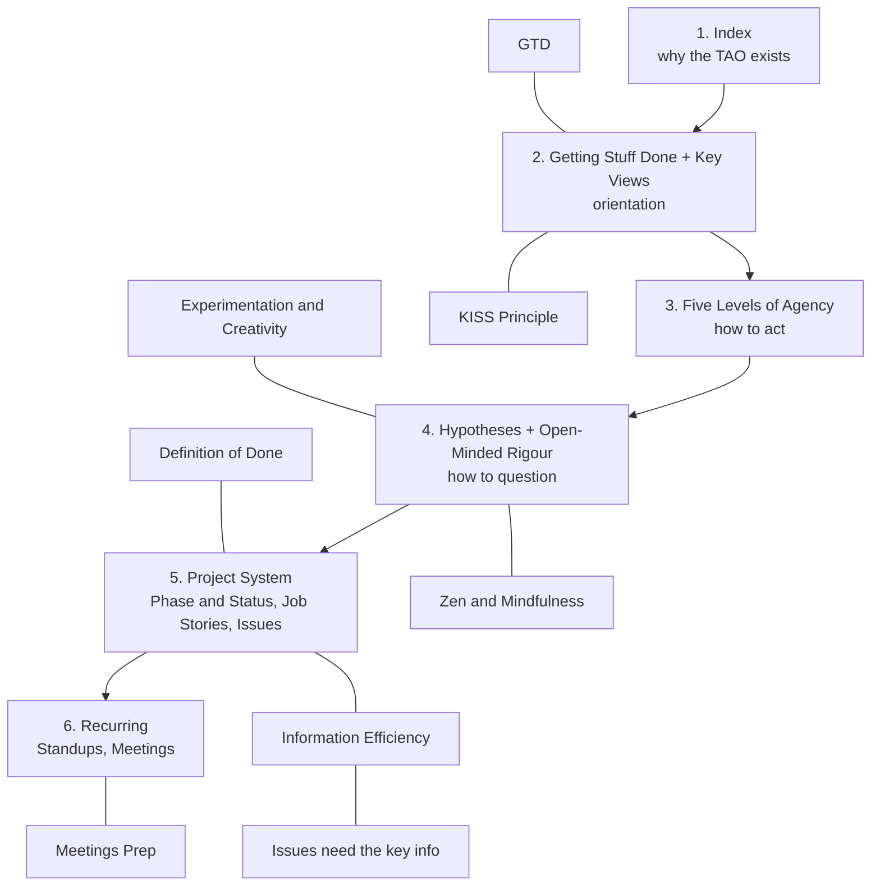

# Roadmap for the TAO

## The map

## The steps, in order

1. **[Index](https://tao.rufuspollock.com)**: why the TAO exists, how to read it. Start here.
2. **[Getting Stuff Done](https://lifeitself.org/tao/getting-stuff-done) + [Key Views](https://tao.rufuspollock.com)**: orientation before anything else. Also pull in the fuller [Life Itself DAO version](https://tao.lifeitself.org/principles/). Sits next to two habits from onboarding that now have pages: **[GTD](https://rufuspollock.com/post/getting-things-done)** and the **[KISS Principle](https://tao.rufuspollock.com/KISS+Principle)**.
3. **[Five Levels of Agency](https://tao.rufuspollock.com/Five+levels+of+agency)**: how to act.
4. **[Hypotheses](https://tao.rufuspollock.com/Hypotheses) + [Open-Minded Rigour](https://tao.lifeitself.org/principles/#open-minded-rigour)**: how to question. Two more DAO principles belong here: **[Experimentation and Creativity](https://tao.lifeitself.org/principles/#experimentation-and-creativity)** and **[Zen & Mindfulness](https://tao.lifeitself.org/principles/#zen--mindfulness)**.
5. **The project system**: [Project Phase and Status](https://tao.rufuspollock.com/Project+Phase+and+Status), [Job Stories](https://tao.rufuspollock.com/Job+Stories), [Issues](https://tao.rufuspollock.com/Issues). Two more from onboarding now have pages: **[Definition of Done](https://tao.rufuspollock.com/Definition+of+Done)**, **[Information Efficiency](https://tao.rufuspollock.com/Information+Efficiency)** -- whose direct consequence, **issues need to carry all the key information**, already lives inside the [Issues](https://tao.rufuspollock.com/Issues) page itself rather than as its own.
6. **Recurring**: [Standups](https://tao.rufuspollock.com/Standups), [Meetings](https://tao.rufuspollock.com/Meetings), plus **[Meetings Prep](https://tao.rufuspollock.com/Meetings+Prep)**: notes on Google Docs, questions prepared beforehand, the meeting recorded, transcribed with Granola.

Bold with no link = onboarding-only, still no TAO page of its own (notes on [planning#15](https://github.com/rufuspollock/planning/issues/15)).
