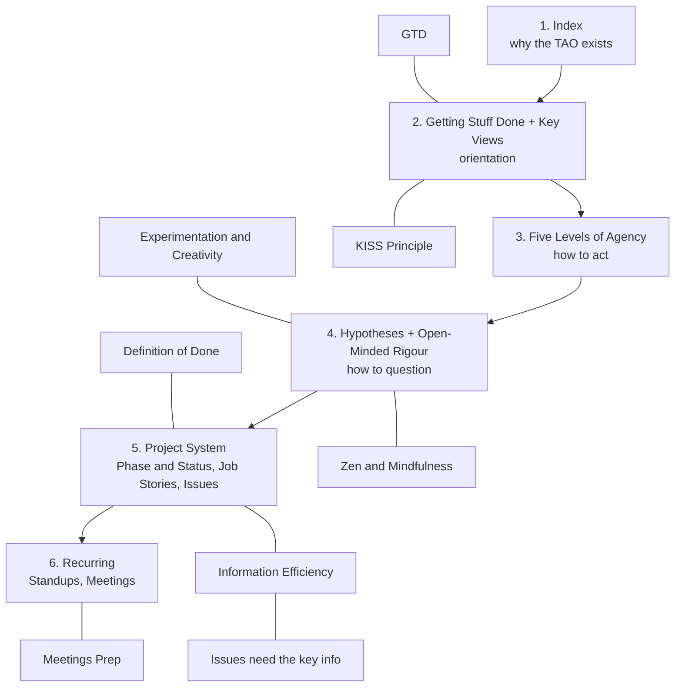

# Roadmap for the TAO

## The map

```mermaid
graph TD
    s1["1. Index<br/>why the TAO exists"]
    s2["2. Getting Stuff Done + Key Views<br/>orientation"]
    s3["3. Five Levels of Agency<br/>how to act"]
    s4["4. Hypotheses + Open-Minded Rigour<br/>how to question"]
    s5["5. Project System<br/>Phase and Status, Job Stories, Issues"]
    s6["6. Recurring<br/>Standups, Meetings"]

    s1 --> s2 --> s3 --> s4 --> s5 --> s6

    gtd[GTD] --- s2
    s2 --- kiss[KISS Principle]

    exp[Experimentation and Creativity] --- s4
    s4 --- zen[Zen and Mindfulness]

    dod[Definition of Done] --- s5
    s5 --- infoeff[Information Efficiency]
    infoeff --- keyinfo[Issues need the key info]

    s6 --- prep[Meetings Prep]

    click s1 "https://tao.rufuspollock.com" "Index"
    click s2 "https://lifeitself.org/tao/getting-stuff-done" "Getting Stuff Done"
    click s3 "https://tao.rufuspollock.com/Five+levels+of+agency" "Five Levels of Agency"
    click s4 "https://tao.rufuspollock.com/Hypotheses" "Hypotheses"
    click s5 "https://tao.rufuspollock.com/Project+Phase+and+Status" "Project Phase and Status"
    click s6 "https://tao.rufuspollock.com/Standups" "Standups"
    click gtd "https://rufuspollock.com/post/getting-things-done" "Getting Things Done"
    click kiss "https://tao.rufuspollock.com/KISS+Principle" "KISS Principle"
    click exp "https://tao.lifeitself.org/principles/#experimentation-and-creativity" "Experimentation and Creativity"
    click zen "https://tao.lifeitself.org/principles/#zen--mindfulness" "Zen and Mindfulness"
    click dod "https://tao.rufuspollock.com/Definition+of+Done" "Definition of Done"
    click infoeff "https://tao.rufuspollock.com/Information+Efficiency" "Information Efficiency"
    click keyinfo "https://tao.rufuspollock.com/Issues" "Issues"
    click prep "https://tao.rufuspollock.com/Meetings+Prep" "Meetings Prep"
```
