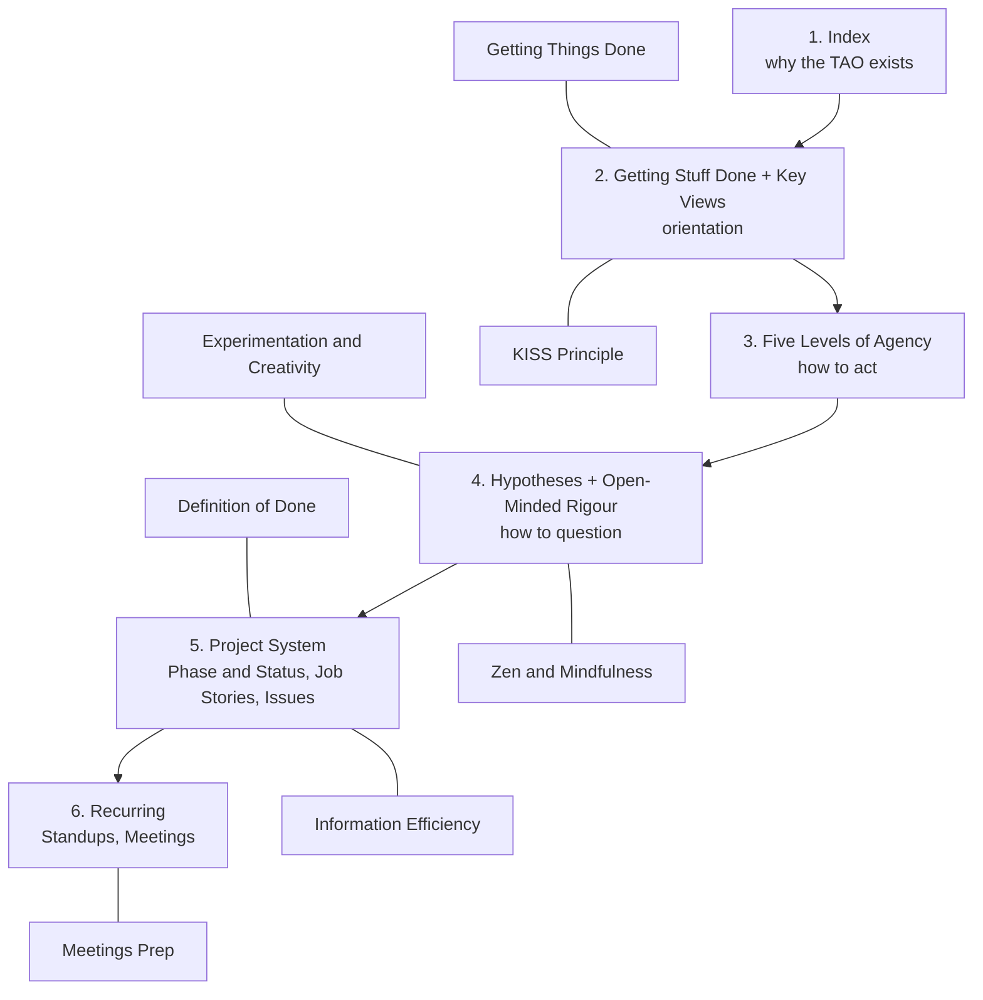

# Roadmap for the TAO

A draft roadmap, kept in-repo rather than published to the site nav for now.

## The map

## The steps, in order

1. **[Index](https://tao.rufuspollock.com)**: why the TAO exists, how to read it. Start here.
2. **[Getting Stuff Done](https://tao.rufuspollock.com/Getting+Stuff+Done) + Key Views** (see the [Index](https://tao.rufuspollock.com) page's Views section): orientation before anything else. Sits next to two habits that also live here now: **[Getting Things Done](https://tao.rufuspollock.com/Getting+Things+Done)** and the **[KISS Principle](https://tao.rufuspollock.com/KISS+Principle)**.
3. **[Five Levels of Agency](https://tao.rufuspollock.com/Five+levels+of+agency)**: how to act.
4. **[Hypotheses](https://tao.rufuspollock.com/Hypotheses) + [Open-Minded Rigour](https://tao.rufuspollock.com/Open-Minded+Rigour)**: how to question. Two more belong here: **[Experimentation and Creativity](https://tao.rufuspollock.com/Experimentation+and+Creativity)** and **[Zen and Mindfulness](https://tao.rufuspollock.com/Zen+and+Mindfulness)**.
5. **The project system**: [Project Phase and Status](https://tao.rufuspollock.com/Project+Phase+and+Status), [Job Stories](https://tao.rufuspollock.com/Job+Stories), [Issues](https://tao.rufuspollock.com/Issues) (which already covers issues needing all their key information). Two more attach here: **[Definition of Done](https://tao.rufuspollock.com/Definition+of+Done)** and **[Information Efficiency](https://tao.rufuspollock.com/Information+Efficiency)**.
6. **Recurring**: [Standups](https://tao.rufuspollock.com/Standups), [Meetings](https://tao.rufuspollock.com/Meetings), plus **[Meetings Prep](https://tao.rufuspollock.com/Meetings+Prep)**: notes on Google Docs, questions prepared beforehand, the meeting recorded, transcribed with Granola.

Adapted from the roadmap notes in [rufuspollock/planning#15](https://github.com/rufuspollock/planning/issues/15).
